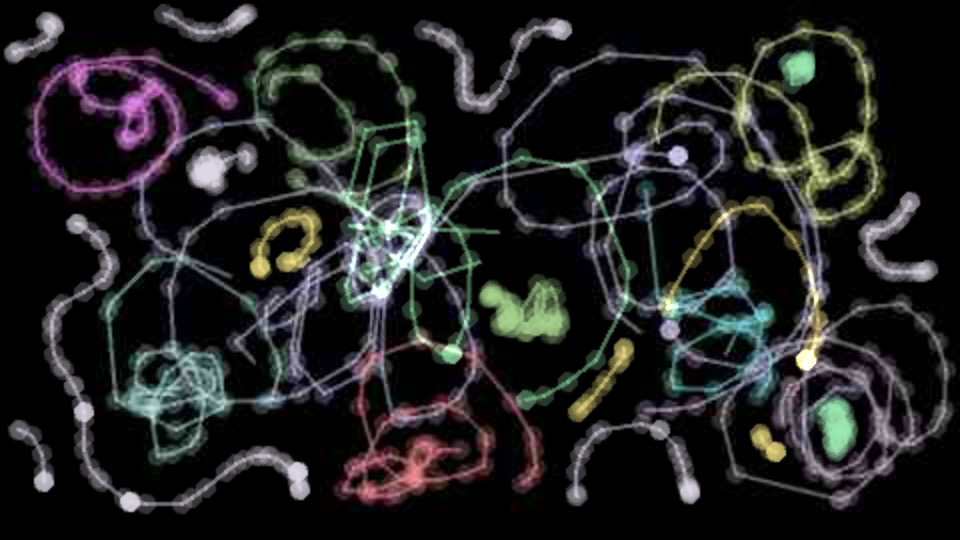

# ExquisiteOsc

#### ExquisiteOsc.pde
This is where the <b>main setup() and draw() functions</b> live. Most of your drawing work can be done here.

#### Controls.pde
If you want to add <b>keyboard and mouse controls</b>, you can put them here.

#### settings.txt
You'll need to change your <b>port and ip numbers</b> here in order to set up OSC networking.

#### The rest of the sketch:

<b>Jpeg.pde</b> encodes and decodes jpeg images to send over the network. 

<b>Osc.pde</b> sends and receives images using OSC, a popular networking protocol for art and music. 

<b>Record.pde</b> records screenshots you can assemble into an animation. 

<b>Settings.pde</b> loads the settings.txt file. 